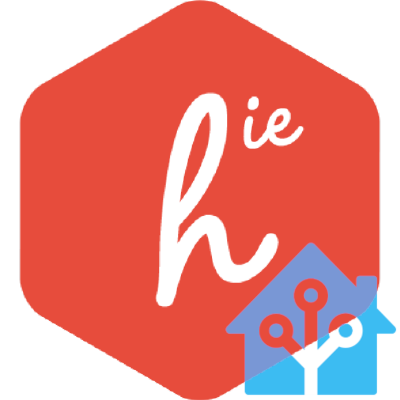
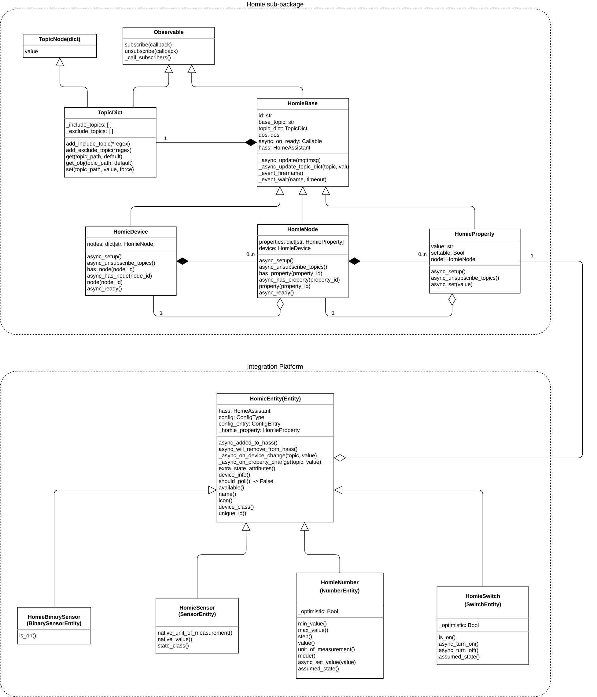
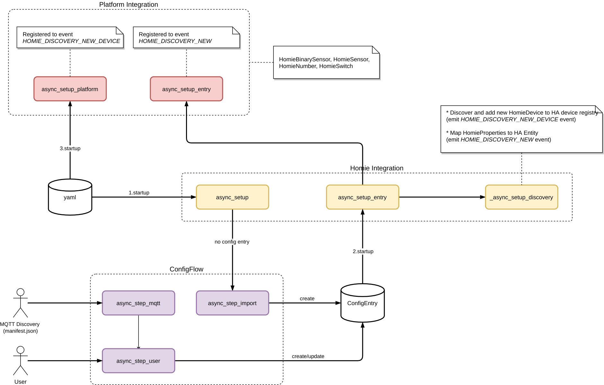

[![Issues][issues-shield]][issues-url]
[![GPL License][license-shield]][license-url]
[![Homie][homie-shield]][homie-url]
[![HA][ha-shield]][ha-url]
[![LinkedIn][linkedin-shield]][linkedin-url]

<p align="center">
  
  <h3 align="center">Homie integration for Home Assistant</h3>
  <p align="center">
    Autodiscover and/or manual Homie devices configuration
  </p>
</p>
<br />

## About The Project

This HomeAssistant integration is born (and maybe will dead) as University project. The project was started from the old, abandoned and closed issue [Compatibility with Home Assistant MQTT Discovery](https://github.com/homieiot/homie-esp8266/issues/306).

## Getting Started

### Installation

Download the zip from `Code/Download ZIP` and uncompress the `homie` folder in the HA `custom_components` directory:

```bash
cd YOUR_HA_CONFIG_DIRECTORY		# same place as configuration.yaml
mkdir -p custom_components/homie
unzip ha-homie-master.zip 
mv ha-homie-master/homie custom_components
rm ha-homie-master.zip
```

Alternatively, you can install the current GitHub master version by cloning and copying:

```bash
mkdir SOME_LOCAL_WORKSPACE
cd SOME_LOCAL_WORKSPACE
git clone https://github.com/elbowz/ha-homie.git
mkdir -p YOUR_HASS_CONFIG_DIRECTORY/custom_components
cp -r ha-homie/homie YOUR_HASS_CONFIG_DIRECTORY/custom_components
```

Restart Home assistant

> **tip**: if you have some Homie devices in your network, you should already see the discovery tile in home assistant, that advice to configure this integration

## Configuration

Go to the Integrations menu in the Home Assistant Configuration UI and add `Homie` from there.

Alternatively, add `homie:` to `<config>/configuration.yaml`.

> **note**: you can use yaml configuration or UI configuration, but remember that the UI options overwrite the yaml config.

```yaml
homie:
  base_topic: +
  qos: 2
  discovery: true
```

The Homie base discovery topic is `+/+/$homie`. You can restrict using the `base_topic` option.

eg. `base_topic = root` => the discovery topic become: `root/+/$homie`

## Manual Configuration

With `discovery: true` all the recognised devices properties (and related attributes) are added in HA as entities. But you also can add them manually and set preferred attributes by configuration.yaml as platform. You can use it with or without discovery activated.

The supported platfrom are:

* **Switch**
* **Binary sensor**
* **Sensor**
* **Number**

`configuration.yaml` switch example:

```yaml
switch:
  - platform: homie
    name: Led light
    icon: mdi:lightbulb-variant-outline
    #enabled_by_default: true # default
    #qos: 1 # default
    property:
      device: device-id
      node: node-id
      name: property-id
    #property_topic: device-id/node-id/property-id # alternative to "property"
    #optimistic: false # default
    device_class: outlet
```

> **tip**: enable discovery and take `base_topic` from HA entity attributes. There will find also stored other device information (eg. stats, IP, etc...)

### Shared config options between platform

```yaml
name: name displayed
icon: icon
unique_id: id # use if you know
enabled_by_default: true # default
qos: 1 # default
property:
  device: device-id
  node: node-id
  name: property-id
property_topic: device-id/node-id/property-id # alternative to "property"
```

| key | default | description |
| :--- | :---: | :--- |
| `property_topic` | none | alternative to `property` key. Allow a plenty of topic format <br />(eg. *root/device-id/node-id/property-id, device-id/node-id/property-id, /device-id/node-id/property-id*) |
| `enabled_by_default` | true | don't display in HA Dashboard but still in entities registry |
| `unique_id` | none | the unique key used internally by HA to store entity information |

### Switch

```yaml
optimistic: false # default
device_class: # see https://www.home-assistant.io/integrations/switch/#device-class
```

### Sensor

```yaml
unit_of_measurement: C
device_class: # see https://www.home-assistant.io/integrations/sensor/#device-class
```

### Binary sensor

```yaml
off_delay: 6 # second delay to off
device_class: # see https://www.home-assistant.io/integrations/binary_sensor/#device-class
```

### Number

```yaml
min: 2.0
max: 10.0
step: 1.0
optimistic: false # default
mode: auto/slider/box
unit_of_measurement: s
```

## Integration development 

For didactic purpose (or who is interested) here can see information/documentation about the Homie custom component development model.

### Class Diagram



### Activity Diagram



## :sparkling_heart: Support the project

I open-source almost everything I can. If you are using this project and are happy with it, please consider one of these ways to support the project (and me):

* Giving proper credit when you use it, linking back to it :D
* Starring :star2: and sharing the project :rocket:
* Submit PRs, bug reports and feature requests
* [![Paypal][paypal-shield]][paypal-url] Make one-time donations via PayPal. I'll probably buy a :beer:

Thanks! :heart:

## License

Distributed under the GPL License. See [LICENSE][license-url] for more information.

## Credits

- [Homie convetion](https://homieiot.github.io/)
- [Homie for ESP8266 / ESP32](https://github.com/homieiot/homie-esp8266)
- [Home Assistant](https://www.home-assistant.io/)
- [HA_Homie](https://github.com/nerdfirefighter/HA_Homie) - Closed/broken old integration...used for inspiration

[issues-shield]: https://img.shields.io/github/issues/elbowz/ha-homie.svg?style=for-the-badge
[issues-url]: https://github.com/elbowz/ha-homie/issues
[license-shield]: https://img.shields.io/github/license/elbowz/ha-homie.svg?style=for-the-badge
[license-url]: /LICENSE.txt
[linkedin-shield]: https://img.shields.io/badge/-LinkedIn-black.svg?style=for-the-badge&logo=linkedin&colorB=555
[linkedin-url]: https://www.linkedin.com/in/emanuele-palombo/
[homie-shield]: https://img.shields.io/static/v1?label=Powered&message=Homie&style=for-the-badge&color=informational
[ha-shield]: https://img.shields.io/static/v1?label=Powered&message=Homeassistant&style=for-the-badge&color=informational
[homie-url]: https://github.com/homieiot/homie-esp8266
[ha-url]: https://www.home-assistant.io/
[paypal-shield]: https://img.shields.io/badge/-Donate-black.svg?style=flat-square&logo=paypal&colorB=555
[paypal-url]: https://www.paypal.me/EmanuelePalombo
